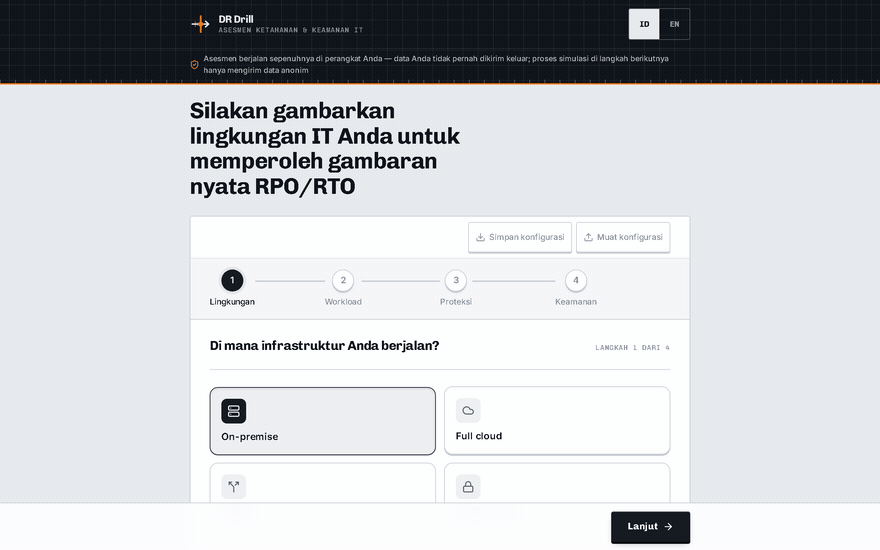
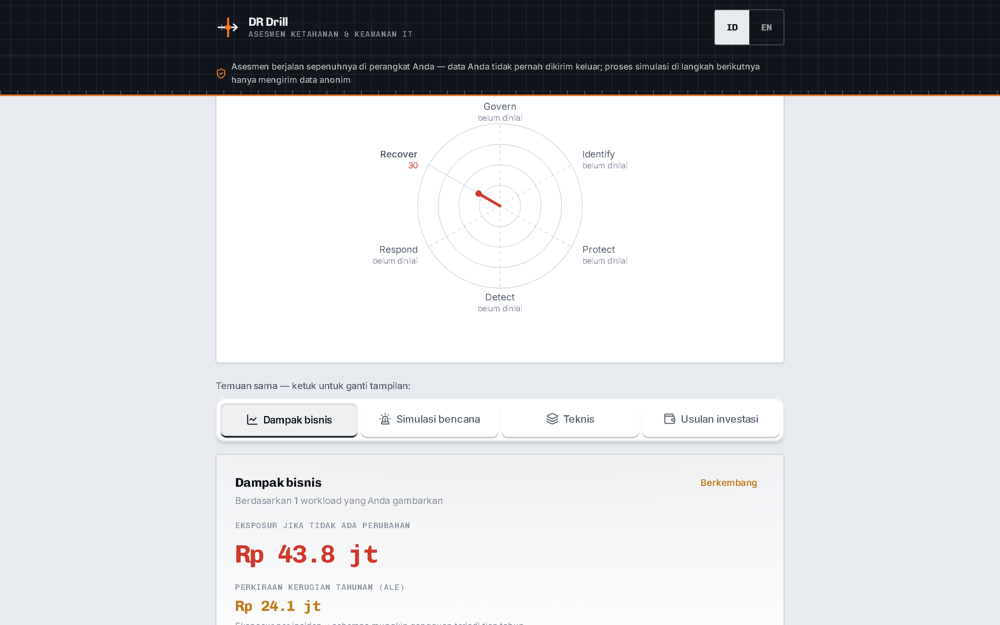
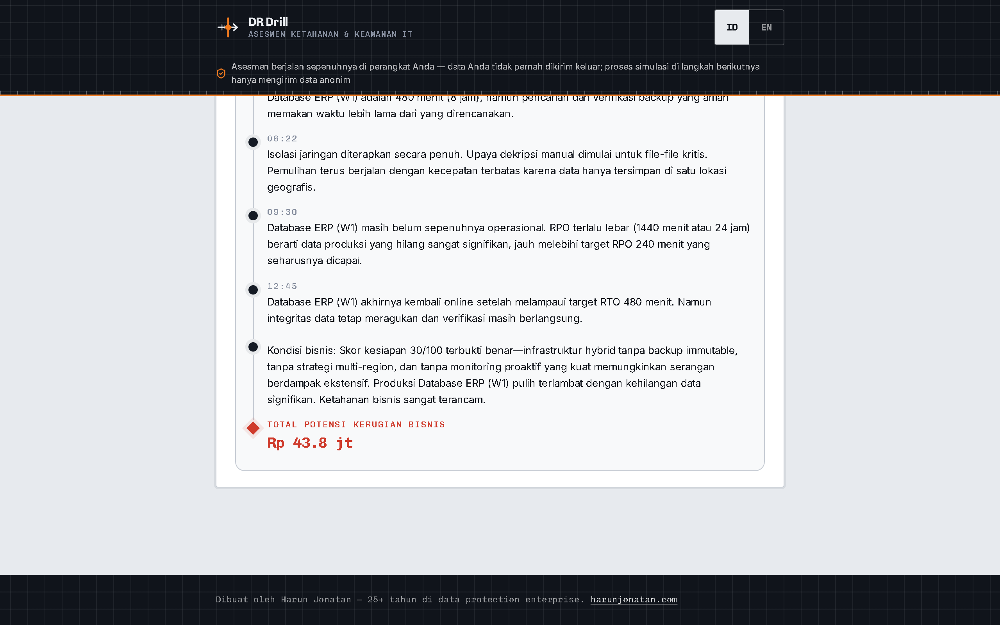
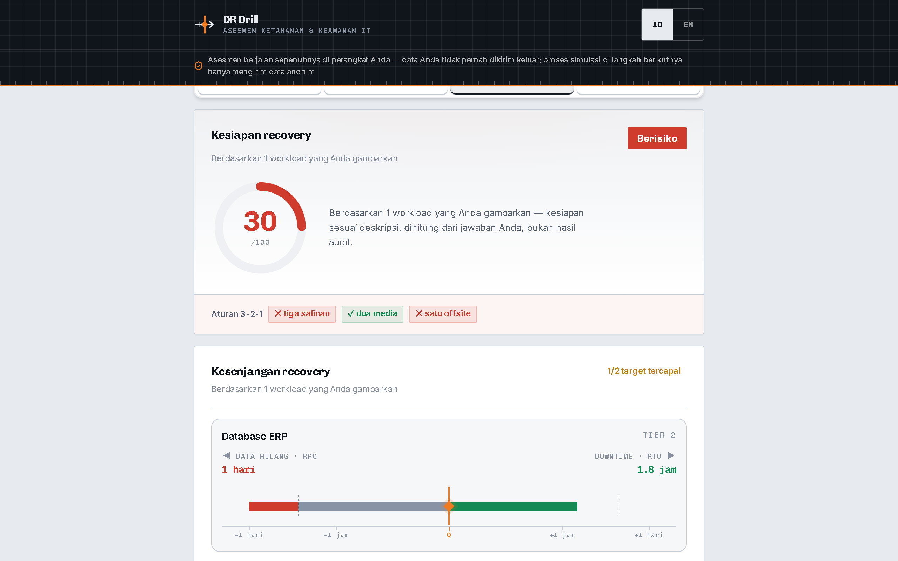

# DR Drill

**Live: [drdrill.harunjonatan.com](https://drdrill.harunjonatan.com)**

A browser-only business-continuity / disaster-recovery readiness instrument,
bilingual (Indonesian-first, English). Describe your environment — workloads,
backup posture, security controls — and a deterministic engine computes the
RPO/RTO you can *actually* achieve, scores your readiness against NIST CSF /
ISO 22301, and translates the technical gaps into the business case an IT
manager needs to win investment from a non-technical owner.

Built by Harun Jonatan · [harunjonatan.com](https://harunjonatan.com)



## What it does

- **One assessment, three lenses.** The same computed findings rendered for
  three audiences: business impact (money exposure, heatmap), technical
  (per-workload RPO/RTO on the Incident Timeline, risk flags with
  mechanism-level explanations), and an investment case (prioritized asks,
  each translated into plain-language business risk).
- **AI disaster drill.** An LLM retells the findings as a timed incident
  story — beats revealing live down a timeline while the exposure meter
  counts the money bleeding. The model narrates; it never computes (see below).
- **C-level PDF export.** A board-ready investment justification built
  client-side (jsPDF, vector, no server round-trip), carrying the product's
  visual identity onto the document that gets forwarded upward.
- **Save/load config.** The intake exports/imports as a local JSON file, so an
  assessment can be repeated or reviewed without retyping — still browser-only.

## Screenshots

| | |
|---|---|
|  |  |



## The two rules that govern everything

### 1. Trust boundary — real names never leave the browser

The only structure allowed to leave the browser is `FindingsPayload`
(`lib/engine.ts`), which identifies workloads solely by pseudonymized labels
`W1..Wn`. Real workload names, sizes, and money stay client-side.

- The server re-validates every request with a hand-rolled, exact-shape
  validator (`lib/narrative.ts`) — unknown keys or non-`W\d+` labels are
  rejected; it never trusts the client to have stripped names.
- The browser re-substitutes real names into the validated story *after*
  generation (`substituteLabels`).
- Money and exposure live in browser-only derivations (`lib/exposure.ts`)
  and can never enter the payload.

### 2. Deterministic engine — the LLM retells, it never computes

Every number on screen comes from pure functions in `lib/engine.ts`, with
every tunable constant in one reviewable file (`lib/calibration.ts`). The
narrative layer is caged mechanically, not by prompt-trust:

1. The prompt forbids inventing any number except clock times.
2. `validateNarrative()` scans the returned story client-side and rejects any
   number not derivable from the findings (minute→hour/day conversions
   allowed).
3. On failure: regenerate once, then withhold the story entirely.

A wrong LLM number therefore *cannot* reach the screen — and if the narrative
service is down, the deterministic report above it is untouched by design.

## Design

The visual system is built around DR's one iconic artifact: the
**RPO ← incident → RTO axis**. A shared log time-scale (`lib/timeline.ts`,
unit-tested geometry) draws every workload's data-loss and downtime against
its targets, broken at an amber `t=0` marker — the same mark that is the
logo, the favicon, the masthead's page-wide ruled edge, and the PDF header.
Interactive controls are ink (never SaaS blue); amber is reserved for the
incident; all option controls share a physical "keycap" press. Type: Chivo /
Chivo Mono / Inter.

## Stack

Next.js (App Router) · React · Tailwind v4 · jsPDF (client-side) · Vitest.
Validators are hand-rolled rather than schema libraries — the shapes are
small and fixed, and zero dependencies keeps the one paid route auditable.
No database, no accounts, no sessions: the only server-side state is a
best-effort in-memory per-IP rate limiter (`lib/ratelimit.ts`) on the warm
function instance, plus anonymous aggregate usage counts (Vercel Web
Analytics).

## Development

```bash
npm install
npm run dev     # http://localhost:3000
npm test        # vitest — engine, timeline, narrative-validation suites
npm run lint
npm run build
```

Copy `.env.example` to `.env.local` and fill in keys. Without LLM keys the
assessment works fully; the drill section degrades gracefully.

## Deployment

- Vercel, production branch `master`; domain `drdrill.harunjonatan.com`.
- Environment variables: see `.env.example` (`ANTHROPIC_API_KEY` primary,
  `DEEPSEEK_API_KEY` fallback).
- Rate limiting is in-memory — nothing external to provision. The hard cost
  ceiling is the provider spend cap + `max_tokens`.

Docs: requirements in `docs/brainstorms/`, implementation plans in
`docs/plans/`, launch gates in [`docs/launch-checklist.md`](docs/launch-checklist.md).
