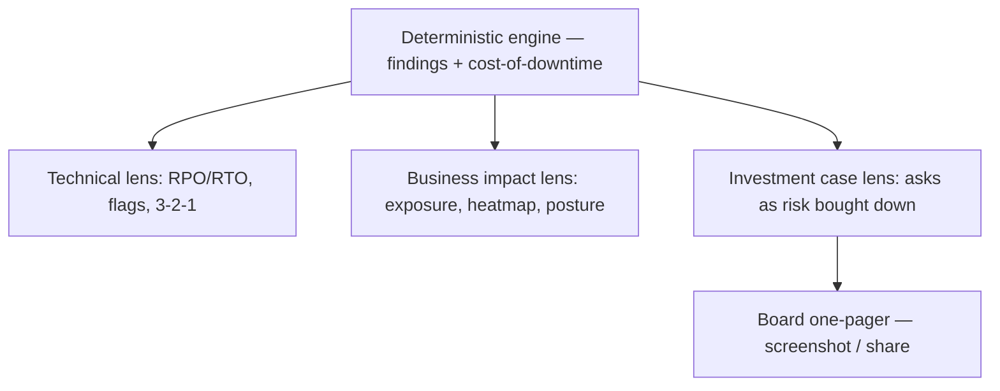

# DR Drill — Executive View (funding-proposal layer) — Requirements

## Summary

Add an executive layer to DR Drill: one assessment, three audience lenses the user chooses between — **Technical** (today's RPO/RTO, flags, 3-2-1), **Business impact** (a BIA-lite led by money exposure, a risk heatmap, and a posture score against a named framework), and **Investment case** (prioritized asks framed as *risk bought down*, assembled into a shareable board one-pager). The readiness check becomes a defensible funding proposal an IT manager can take upward — no accounts, still browser-only.

This doc extends the base product requirements in `docs/brainstorms/2026-07-08-dr-drill-simulator-requirements.md`; its R-IDs are their own namespace.

---

## Problem Frame

The base tool answers "where do we stand" for the IT manager. But the IT manager's harder job is upward: convincing leadership to fund continuity before an incident, not after. In that room the technical artifact fails — a screenshot of RPO/RTO gaps means nothing to a CFO, and "we need immutable backups" reads as an IT wish, not a business case. Leadership funds against three things: the money at risk, how much risk a spend buys down, and a credible frame behind the numbers. Today the IT manager assembles that by hand the night before, or doesn't, and the ask dies for lack of a defensible business translation. DR Drill already computes the technical truth; the gap is turning it into the language a board acts on.

---

## Key Decisions

- **Executive layer as three audience lenses, not a second product.** The same findings render three ways, chosen by reader. This keeps the tool's sharpness and keeps the technical rigor — the source of the numbers' credibility — first-class rather than demoted beneath a one-pager.
- **Money on the risk side; the fix is framed as risk bought down.** Exposure in currency is computable and defensible from the engine. Pricing a mitigation depends on vendors and contracts, so the tool never prices the fix — it names the control and the exposure, time, and posture it removes. Pricing stays with the vendor quote.
- **Heatmap axes are impact × readiness gap, not impact × likelihood.** A probability axis would force invented numbers and break defensibility. The second axis is the engine's own gap severity (target misses, critical flags).
- **BIA framing, anchored to ISO 22301 with a NIST CSF nod.** The Business impact lens is named as a Business Impact Analysis, aligned with ISO 22301 (the business-continuity standard) and with a NIST CSF reference for cyber-resilience — presented as self-assessment "aligned with," never certification.
- **Additive to the existing engine and privacy model.** Exposure, heatmap, and posture are one new computation over existing findings plus one new input. No accounts, no stored data; the cost figure and environment detail stay in the browser.

---

## Actors

- A1. IT manager / IT head (operator) — runs the assessment, picks lenses, owns and presents the proposal upward.
- A2. Leadership / board (decision audience) — reads the Business impact and Investment case outputs to approve or reject continuity funding; never touches the tool.
- A3. Data-protection practitioner (credibility bar) — the skeptical reader whose scrutiny the exposure and heatmap must survive.

---

## Requirements

**Intake — cost of downtime**

- R1. The intake adds an optional cost-of-downtime figure (currency per hour) per workload, with a "same for all" and "by tier" quick-fill so the full intake still completes from memory in under ~10 minutes.
- R2. When cost-of-downtime is omitted, the Business impact and Investment case lenses still render qualitatively (downtime hours plus posture); the money framing is simply absent and no lens is blocked.

**Output lenses**

- R3. One assessment yields three selectable audience lenses — Technical, Business impact, Investment case — all computed from the same findings; the Business impact lens opens by default, and switching lenses re-renders and never re-runs the assessment or re-enters data.
- R4. The Technical lens is the existing report (RPO/RTO gaps, risk flags, 3-2-1, achievable vs target), unchanged.
- R5. The Business impact lens leads with money exposure, a risk heatmap, and a posture score named as a BIA aligned with ISO 22301 (with a NIST CSF reference for cyber-resilience).
- R6. The Investment case lens presents prioritized asks, each framed as risk bought down — exposure closed (currency), recovery-time reduction, and posture shift (e.g., red→green) — never as a price to buy.
- R7. The Investment case assembles into a board-ready one-pager the user can screenshot or share; every lens is individually shareable and screenshot-legible at phone width (extends base R10, R16).

**Money model (defensible)**

- R8. Exposure is achievable downtime (RTO) × cost-of-downtime per hour, shown per workload and aggregated, and labeled "as described" — a conditional estimate on self-reported inputs, not an audited loss.
- R9. A workload with no recovery path is shown with a distinct catastrophic/unbounded treatment, never a finite figure and never infinity.
- R10. The tool never prices a fix; each ask names the control (immutable copy, offsite/cross-region, second site) and the exposure, time, or posture it removes, and points pricing to a vendor quote.

**Risk heatmap**

- R11. The Business impact lens plots workloads on a heatmap whose axes are impact (money exposure, or criticality tier when cost is absent) × readiness gap (target-miss and critical-flag severity), with no likelihood or probability axis.
- R12. The heatmap reuses the design system's semantic tints and is legible as a standalone phone screenshot, with every cell carrying a text label (color is never the sole signal).

**Preserved guarantees**

- R13. All new computation — exposure, heatmap, posture — runs in the browser; the cost-of-downtime figure and environment detail never leave the device (extends base R8).
- R14. The deterministic lenses render without the narrative; the drill remains one scenario part and degrades gracefully if generation fails (base R13).
- R15. Framework anchoring is presented as self-assessment "aligned with," never certification, compliance attestation, or audit.
- R16. All three lenses are bilingual ID/EN; money renders in the locale's currency and format; switching language preserves entered data and cost inputs (extends base R14, R23).

---

## Key Flows

- F1. Choose the audience view
  - **Trigger:** The assessment has run; the report is on screen.
  - **Actors:** A1
  - **Steps:** Report renders in the Business impact lens by default; user switches to Technical or Investment case; each renders instantly from the same findings.
  - **Outcome:** An audience-appropriate view without re-entering the environment.
  - **Covers:** R3, R4, R5, R6.
- F2. Build and share the board one-pager
  - **Trigger:** User is on the Investment case lens.
  - **Actors:** A1, A2
  - **Steps:** The lens assembles a one-pager — exposure headline, posture, prioritized asks with risk bought down, and a coverage line; user screenshots or shares it.
  - **Outcome:** A board-ready funding artifact; nothing is persisted.
  - **Covers:** R6, R7.

---

## Acceptance Examples

- AE1. **Covers R8.** Given a Tier-1 database with an achievable RTO of 24h and a cost-of-downtime of Rp 5,000,000/hour, when the Business impact lens renders, then it shows Rp 120,000,000 exposure for that workload, labeled "as described."
- AE2. **Covers R2.** Given the user left cost-of-downtime blank, when the Business impact lens renders, then it shows 24h downtime and a red posture with no currency, and the lens is not blocked.
- AE3. **Covers R6, R10.** Given a no-immutable-copy flag, when the Investment case lens renders, then the "immutable copy" ask states it closes the ransomware-loss exposure and moves ransomware red→green, and names no price.
- AE4. **Covers R11.** Given a workload that misses its RTO target and carries a critical flag, when the heatmap renders, then it plots at high impact / high gap, with no probability entered anywhere.
- AE5. **Covers R3, R16.** Given the user switches Technical→Business impact and ID→EN, when the view updates, then it uses the same findings, preserves entered workloads and cost inputs, and reformats money to the locale.
- AE6. **Covers R9.** Given an unrecoverable workload, when exposure renders, then it shows a catastrophic/unbounded treatment rather than a number.

---

## Success Criteria

- An IT manager takes the Investment case one-pager into a budget meeting and a non-technical approver understands the exposure and the ask without translation.
- A data-protection practitioner reading the exposure and heatmap finds them defensible — no invented prices, no invented probabilities.
- Each of the three lenses is screenshot-legible on its own at phone width.

---

## Scope Boundaries

**Deferred for later**

- Peer / industry benchmarking and any stored community data — collides with the stateless promise.
- Interactive, story-first playable drill — remains the v2 headline.
- PDF export and shareable result links (base doc deferral).

**Outside this product's identity**

- Pricing fixes or recommending vendors/products — the tool names the control, never a price or a brand.
- Compliance certification, formal BIA document generation, or audit attestation — this is a wake-up call and a funding aid, not a compliance artifact.

---

## Dependencies / Assumptions

- Extends the base requirements (`docs/brainstorms/2026-07-08-dr-drill-simulator-requirements.md`) and the existing deterministic engine (`lib/engine.ts`) — additive, not a rewrite.
- Exposure math (downtime × cost, and the risk-bought-down mapping per control) needs a practitioner calibration pass by the operator, like the existing tier-target calibration.
- Cost-of-downtime is user-supplied and rough; exposure is only as good as that input, which is why it is labeled "as described."
- The LLM key remains only for the drill narrative; all three lenses render without it.
- Demand for the executive framing is still an assumption; the base R24 usage events extend to lens-view and one-pager events as the go/no-go signal.

---

## Outstanding Questions

**Deferred to planning**

- Exposure formula edges: downtime-only vs including a data-loss (RPO) exposure term; how per-workload exposure aggregates; the numeric treatment of unrecoverable workloads.
- Heatmap band thresholds and how each axis is quantized.
- The risk-bought-down mapping: which control removes which exposure or flag, and how partial reductions are shown.
- One-pager assembly and share mechanism, and per-locale currency formatting.
