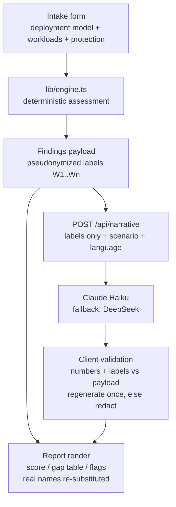

# feat: DR Drill Simulator v1

## Summary

Build v1 of DR Drill (drdrill.harunjonatan.com): a bilingual (ID/EN) business-continuity readiness tool. A deterministic browser-side engine assesses the user's environment across four deployment models and renders a four-part report; a server route narrates a pseudonymized, rate-capped, mechanically validated drill scenario via LLM. Six implementation units, rewriting the existing first-cut engine and page.

---

## Problem Frame

Indonesian mid-market IT managers cannot answer "if ransomware hits tonight, when are we back?" with a defensible number; existing assessment tools are English-language vendor funnels (see origin: docs/brainstorms/2026-07-08-dr-drill-simulator-requirements.md). The origin doc fixes WHAT: 24 requirements (R1–R24), two actors, two flows, five acceptance examples. This plan fixes HOW.

---

## Requirements Trace

The origin doc's R-IDs are authoritative; this plan traces them to units rather than restating them.

- **Intake (R1–R4):** U2, on the engine types from U1.
- **Engine (R5–R8):** U1.
- **Report (R9, R10, R16–R18):** U3.
- **Drill narrative (R11–R13, R19–R22):** U4, consuming U1's findings payload.
- **Language (R14, R15, R23):** U5; attribution/hosting in U6.
- **Measurement (R24):** U6.
- **Acceptance examples AE1–AE5:** enforced as named test scenarios in U1, U4, U5.

---

## Key Technical Decisions

- **Narrative provider: Claude Haiku primary, DeepSeek fallback.** R22 requires a no-training/short-retention commitment; Anthropic's API does not train on inputs by default, which satisfies it today. DeepSeek (the operator's usual primary) is the cost fallback pending verification of its retention terms — verify both providers' current terms during U4 and record the result in the privacy page copy.
- **Engine is a pure TypeScript module producing a `Findings` payload with pseudonymized labels.** One computation (`lib/engine.ts`) feeds both the report (browser re-substitutes real names) and the narrative call (labels only, `W1…Wn`). The payload is the single trust boundary: nothing outside it ever reaches the server (R8, R12).
- **Three adaptive intake paths, not four.** On-premise and private cloud share one structure with different labels/copy; full cloud is distinct (snapshots/cross-region); hybrid adds a per-workload placement toggle, with protection questions asked per placement group (resolves the origin's deployment-model and private-cloud-vs-hybrid open questions; R1, R3).
- **Rate limiting in two layers.** Client-side session cap (one generation per scenario + small total budget, R19) plus server-side per-IP sliding-window limit on the narrative route using Upstash Ratelimit's free tier (serverless-safe; in-memory counters don't survive serverless instances).
- **Narrative validation is a client-side whitelist check.** The LLM returns a fixed structure (timestamped beats); the browser verifies every numeric token and workload label against the findings payload, regenerates once on failure, then redacts (R20, R21). Same layered anti-hallucination pattern as the operator's other products.
- **i18n via an in-app dictionary module, not next-intl.** One page, two locales; locale files under `lib/locales/`, language state client-side, entered data survives switches (R14). The narrative is generated in the selected language by a prompt parameter — one call per generation, never dual generation; a post-report switch regenerates within the R19 cap (R23).
- **Telemetry via Vercel Web Analytics custom events.** Anonymous, cookie-free counts for page view / assessment completed / narrative generated / scenario swapped — satisfies R24 without a database or the stateless promise breaking.
- **Calibration constants isolated in one module** (`lib/calibration.ts`): tier targets, restore throughput, cloud snapshot/failover math, each with a source comment. The operator's practitioner pass over this file is a launch gate (origin Outstanding Question; see U6 checklist).
- **Testing: Vitest, engine-first.** Every engine and validation function gets unit tests (the konverterteks discipline); UI is verified by scenario, no e2e framework in v1.

---

## High-Level Technical Design

Environment data never crosses the browser boundary except as the pseudonymized findings payload (right branch). The report renders fully without the right branch (R13).

---

## Implementation Units

### U1. Deterministic engine v2

- **Goal:** Rewrite `lib/engine.ts` into the deployment-model-aware engine producing the pseudonymized `Findings` payload.
- **Requirements:** R5–R8, R12 (label pseudonymization); implements the engine side of R1's model-variant derivation (intake ownership of R1–R4 stays with U2 per the Requirements Trace).
- **Dependencies:** none.
- **Files:** `lib/engine.ts`, `lib/calibration.ts`, `lib/engine.test.ts`, `package.json` (add Vitest).
- **Approach:** Pure functions; deployment model selects the RPO/RTO derivation (backup jobs vs snapshots vs replication; hybrid resolves per workload placement). Output: per-workload results, risk flags, 3-2-1 verdict, 0–100 score, and a `Findings` payload keyed by generated labels with a label→name map that never leaves the module's client-side consumer.
- **Patterns to follow:** the existing first-cut `lib/engine.ts` (types, `ponytail:` calibration comments) — keep its shape, extend its semantics.
- **Test scenarios:**
  - Covers AE1. Tier-1 database, nightly backup, no replication, no immutable copy → RPO 24h vs 15-min target (fail) + critical ransomware flag.
  - Covers AE2. Full-cloud, 4-hourly snapshots, no cross-region → RPO from snapshot frequency + region-outage flag.
  - Hybrid: one on-prem workload (backup-derived RPO) and one cloud workload (snapshot-derived RPO) in the same assessment.
  - Unprotected workload (no backup, no replication) → "unrecoverable" result + critical flag.
  - Private cloud follows the on-prem derivation path.
  - Score bounds: all-green environment scores ≥90; unprotected-everything scores ≤20; score never leaves 0–100.
  - Findings payload contains no real workload names; label map round-trips names correctly.
- **Verification:** all engine tests green; payload snapshot for a sample environment contains only `W<n>` labels.

### U2. Adaptive intake UI

- **Goal:** Multi-step, mobile-first intake: deployment model → workloads (add/edit/remove, 5–10 cap) → protection questions per model path.
- **Requirements:** R1–R4, R16.
- **Dependencies:** U1 (types).
- **Files:** `app/page.tsx`, `components/intake.tsx`.
- **Approach:** Three path variants per the KTD; hybrid injects a placement toggle per workload; zero-workload state disables "run assessment" with a plain explanation; every input answerable from memory (select/number/toggle — no lookups).
- **Test scenarios:**
  - Model switch re-shapes protection questions without losing workload entries.
  - Workload add/edit/remove keeps list state consistent; 10-workload cap enforced with notice.
  - Zero workloads → run action disabled with explanation (unaided-first-use success criterion).
  - Test expectation for visual layout: none — verified by scenario walkthrough on a phone-width viewport.
- **Verification:** an assessment is completable start-to-finish on a 390px viewport in under 10 minutes with sample data.

### U3. Four-part report

- **Goal:** Render score, gap table, risk flags, and the drill section shell as screenshot-self-contained, business-framed parts.
- **Requirements:** R9, R10, R16–R18.
- **Dependencies:** U1.
- **Files:** `components/report.tsx`, `app/page.tsx`.
- **Approach:** Each part carries its own title, verdict, and "based on the N workloads you described / readiness as described" coverage line (R17); flag copy framed as investment asks (R18); single-column mobile layout, gap table reflows rather than scrolls.
- **Test scenarios:**
  - Report renders fully with the narrative section in its degraded state (Covers AE4 shell behavior).
  - Coverage line reflects exactly the entered workload count.
  - Flag copy contains no operator-blame phrasing (spot list: "failure", "neglect", "fault").
- **Verification:** each part screenshots legibly in isolation at phone width.

### U4. Narrative pipeline

- **Goal:** Server route + client integration: pseudonymized findings in, validated bilingual drill story out, capped and degradable.
- **Requirements:** R11–R13, R19–R22; AE3, AE4.
- **Dependencies:** U1, U3.
- **Files:** `app/api/narrative/route.ts`, `lib/narrative.ts` (prompt build + validation), `lib/narrative.test.ts`, `components/drill.tsx`, `.env.example`, `package.json` (add `@upstash/ratelimit`, `@upstash/redis`).
- **Infrastructure:** provision an Upstash Redis free-tier database; record `UPSTASH_REDIS_REST_URL`/`UPSTASH_REDIS_REST_TOKEN` in `.env.example` and the Vercel project settings.
- **Approach:** Route accepts findings payload + scenario + language; provider chain Claude Haiku → DeepSeek; fixed output structure (timestamped beats) streamed to client; client whitelist-validates numbers/labels, regenerates once on failure then redacts; session cap (one per scenario + total budget) client-side, per-IP Upstash limit server-side; scenario picker with ransomware default; prior narrative stays visible with a generating indicator during swaps.
- **Execution note:** verify both providers' current no-training/retention terms before wiring; record the outcome in U6's privacy copy.
- **Test scenarios:**
  - Covers AE3. Findings with `W1` RPO 11h → validated narrative may state 11h; a narrative containing a number absent from findings fails validation and triggers regenerate-then-redact.
  - Covers AE4. Provider error/timeout → drill section degrades gracefully; other report parts unaffected.
  - Prompt-injection shape: workload name containing instruction-like text is label-substituted before the prompt is built (R21) — the raw string never appears in the request body.
  - Session cap reached → notice rendered, no request fired.
  - Fallback: primary provider 500 → fallback provider serves the request.
- **Verification:** narrative validation unit tests green; manual drill generation in both languages for a sample environment.

### U5. Bilingual i18n

- **Goal:** Full ID/EN with state-preserving switch and defined post-report behavior.
- **Requirements:** R14, R23; AE5.
- **Dependencies:** U2, U3, U4.
- **Files:** `lib/locales/id.ts`, `lib/locales/en.ts`, `lib/i18n.ts`, touched components.
- **Approach:** Dictionary module + language state; all UI strings via the dictionary; narrative language passed as prompt parameter; post-report switch re-renders deterministic parts and regenerates the narrative within the cap, else keeps the old language with a notice (R23).
- **Test scenarios:**
  - Covers AE5. Intake filled in Indonesian → switch to English → workloads and protection answers persist.
  - Post-report switch with cap available → narrative regenerates in new language; with cap exhausted → original language + notice.
  - No hardcoded UI strings outside the dictionary (lint-style grep check in test).
- **Verification:** both locales render the full flow without missing-key artifacts.

### U6. Telemetry, privacy copy, deploy

- **Goal:** Ship it: anonymous event counts, the privacy statement, attribution, and the drdrill.harunjonatan.com deployment.
- **Requirements:** R15, R24; origin Dependencies (demand evidence stream, calibration launch gate).
- **Dependencies:** U1–U5.
- **Files:** `app/layout.tsx`, `components/privacy.tsx` (or footer section), `README.md`, `package.json` (add `@vercel/analytics`), Vercel project settings (documented in README, not code).
- **Approach:** Vercel Web Analytics with the four custom events; privacy statement wording mirrors the origin's Key Decision (names never leave the browser; anonymous counts carved out; provider retention commitment stated per U4's verification); footer attribution to harunjonatan.com; deploy to the `harunkerja` Vercel team, subdomain CNAME on harunjonatan.com.
- **Launch checklist (in README):** operator practitioner pass over `lib/calibration.ts` signed off; both locales spot-checked; drill validated in ID and EN; demand-gate threshold and review date written down.
- **Test scenarios:** Test expectation: none — configuration and copy; events verified once in the Vercel dashboard post-deploy.
- **Verification:** production URL serves the tool; four event types visible in analytics after a test run.

---

## Scope Boundaries

Carried from origin — **Deferred for later:** interactive playable drill; PDF export and shareable links; peer benchmarking; lead capture/accounts. **Outside this product's identity:** vendor recommendations; BC/DR documentation generation.

### Deferred to Follow-Up Work

- Swap Upstash for platform-native rate limiting if/when available on the Vercel plan.
- E2E test harness (Playwright) if the tool earns iteration.
- Independent (non-operator) practitioner review of calibration — after launch feedback, per origin FYI.
- GitHub remote wiring and CI (`harunjo/DRdrill`) — deploy-time housekeeping, not a unit.

---

## Risks & Dependencies

- **Indonesian narrative quality is unvalidated** (origin residual): Haiku/DeepSeek prose quality in Indonesian decides the primary audience's experience — U4 manual verification in both languages is the check; fall back to more constrained beat templates if prose quality disappoints.
- **Provider terms drift:** the R22 commitment depends on provider policy at verification time; U4's execution note pins verification to implementation, and the privacy copy states what was verified.
- **Calibration credibility:** wrong constants shipped through the operator's own network is a reputational risk; the U6 launch gate exists for this.
- **Demand unknown:** R24 events are the evidence stream; the origin sets the revisit rule.

---

## Open Questions

**Deferred to implementation**

- Exact calibration values (tier targets, throughput constants) — operator pass at the U6 gate.
- Demand-gate threshold and review window — written into the U6 launch checklist at deploy time.

---

## Sources & Research

- Origin: docs/brainstorms/2026-07-08-dr-drill-simulator-requirements.md (review-hardened, 24 R-IDs).
- Existing first-cut: `lib/engine.ts`, `app/page.tsx` — shape to extend, not treat as fixed.
- Scaffold warning: `AGENTS.md` states this Next.js version has breaking changes — read `node_modules/next/dist/docs/` before writing route/app code (applies to U4 especially).
- Provider precedent: harunjonatan.com's DeepSeek-primary/Haiku-fallback chain — reversed here per R22.
