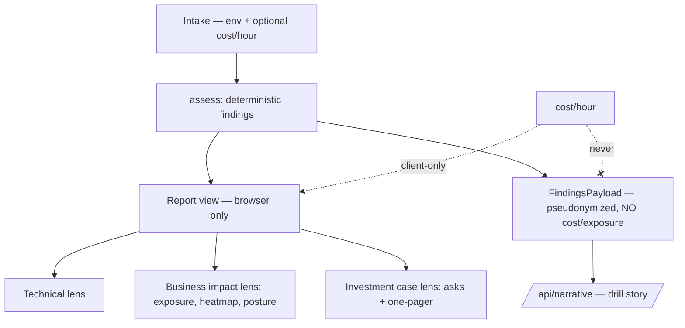

# feat: DR Drill Executive View (three audience lenses)

## Summary

Add an executive layer to DR Drill: one assessment, three audience lenses the user selects between — **Technical** (today's report), **Business impact** (money exposure + risk heatmap + BIA posture, the default), and **Investment case** (prioritized asks framed as *risk bought down*, assembled into a board one-pager). The deterministic engine gains one client-side computation (money exposure and per-control risk-bought-down) fed by one new optional intake input (cost-of-downtime); the narrative trust boundary and stateless privacy model are unchanged.

---

## Problem Frame

The base tool answers "where do we stand" for the IT manager but fails the harder upward job: winning leadership funding for continuity before an incident. A screenshot of RPO/RTO gaps means nothing to a CFO. Leadership funds against money at risk, how much risk a spend buys down, and a credible frame — none of which today's technical report provides. The engine already computes the technical truth; the gap is translating it into board language without inventing numbers or breaking the vendor-neutral, browser-only promises that make the tool trustworthy.

---

## Requirements

Traced from the origin (`docs/brainstorms/2026-07-08-dr-drill-executive-view-requirements.md`).

**Intake**
- R1. Optional cost-of-downtime (Rp/hour) per workload with same-for-all and by-tier quick-fill; intake stays completable in ~10 minutes.
- R2. With cost omitted, Business impact and Investment case still render qualitatively (downtime hours + posture); no lens is blocked.

**Lens system**
- R3. One assessment yields three selectable lenses (Business impact default); switching re-renders from the same findings, never re-runs.
- R4. The Technical lens is today's report, unchanged.
- R7. The Investment case assembles a board-ready one-pager; every lens is individually shareable and screenshot-legible at phone width.

**Money model**
- R8. Exposure = achievable downtime (RTO) × cost/hour, per workload and aggregated; it assumes independent per-workload recovery, so the aggregate is labeled a lower bound "as described."
- R9. A no-recovery-path workload gets a distinct catastrophic/unbounded treatment, never a number, and is surfaced alongside the aggregate ("plus N unrecoverable") rather than silently excluded from it.
- R10. The tool never prices a fix; each ask names the control and the exposure/time/posture it removes.

**Business impact content**
- R5. Business impact leads with money exposure, a risk heatmap, and a posture named as a BIA aligned with ISO 22301 (with a NIST CSF reference).
- R6. Investment case presents prioritized asks framed as risk bought down (exposure closed, recovery cut, posture shift), never a price.
- R11. Heatmap axes are impact (exposure, or tier when cost absent) × readiness gap (target-miss + critical-flag severity); no probability axis.
- R12. Heatmap reuses semantic tints, is phone-legible, and every cell carries a text label (color never the sole signal).

**Preserved guarantees**
- R13. Exposure/heatmap/posture compute in the browser; the cost figure and environment detail never leave the device.
- R14. Deterministic lenses render without the narrative; the drill degrades gracefully (unchanged).
- R15. Framework anchoring reads as self-assessment "aligned with," never certification.
- R16. All three lenses are bilingual ID/EN; switching language preserves entered data and cost inputs.
- R24 (base doc). Anonymous lens-view and one-pager events extend the existing usage counts; no environment data attached — enforced by an event-name-only `track()` convention, not just asserted.

---

## High-Level Technical Design

The load-bearing shape is the **trust boundary**: exposure and lenses are report-view only (real names, cost, money — browser-only), while the findings payload sent to the narrative service stays exactly as today (pseudonymized, no cost, no exposure).



Exposure is a pure derivation over existing results: `exposure = (achievableRtoMin / 60) × costPerHour`, summed across workloads; `null` RTO → catastrophic sentinel. Risk-bought-down is a control→effect lookup keyed by `FlagCode` — time-based effects (second site) recompute RTO via `REPLICA_FAILOVER_MIN`; loss-based effects (immutable/offsite) state the exposure removed and posture shift qualitatively.

---

## Key Technical Decisions

- **Cost and exposure are report-view only; the findings payload is untouched.** `costPerHourDowntime` lives on `Workload` and feeds exposure in the browser; it is never added to `FindingsPayload`. This is the trust-boundary guarantee (R13) and is asserted by test, not convention.
- **Exposure is downtime-only for v1.** `RTO hours × cost/hour`. Data-loss (RPO) monetization is deferred — it needs a per-record/value model that would soften defensibility now. Exposure also assumes independent per-workload recovery (no shared-pipe restore contention); the aggregate is labeled a lower bound "as described."
- **Unrecoverable → catastrophic sentinel, not a number, and never silently dropped from the aggregate.** `aggregateExposure` sums finite exposures and returns a companion count of catastrophic workloads; the headline renders as "≥ Rp X, plus N unrecoverable" so it never reads as a complete total (R8, R9). One catastrophic UI treatment (label + tint token) is defined once and reused across per-workload exposure, the aggregate, and the heatmap impact axis.
- **Risk-bought-down is a table-driven control→effect map keyed by `(FlagCode, scope)`.** Flags are group- or environment-scoped, so the map projects each flag onto the workloads in its scope; hybrid emits duplicate codes across groups and both are kept as distinct asks. Time deltas are computed only where the engine actually delivers them — the `single-site` RTO recompute to `REPLICA_FAILOVER_MIN` applies **only when `replication` is true** (a backup-only workload's RTO is unchanged by a second site); otherwise second-site is a posture-only effect with no minutes. Loss effects (immutable/offsite) stay qualitative. Never emits a price (R10).
- **Posture is derived from continuity sub-signals (target compliance + critical-flag presence), not the raw blended score.** The 0–100 `score` is an explicitly heuristic `compliance*0.6 + hygiene*0.4` linear number, not a maturity model; the posture band maps continuity signals to a named band and is worded as a BIA "aligned with ISO 22301 / NIST CSF," never "certified" (R15).
- **Heatmap axes are impact × readiness gap, not likelihood.** Avoids invented probabilities (R11).
- **Lens selector on the report; Business impact default.** The existing four report parts are *extracted* into the Technical lens, not rewritten — protects the shipped UI.
- **Currency is IDR (Rp) in both languages** via a compact format helper; the business is Indonesian. A USD option is deferred.
- **i18n parity carried per unit.** Each unit adds its keys to both `en.ts` and `id.ts`; the two stay structurally identical (`typeof en`).

---

## Output Structure

New files (per-unit `Files` remain authoritative):

```text
components/
  report.tsx            (refactor → lens container + selector)
  heatmap.tsx           (new)
  lenses/
    technical-lens.tsx  (new — today's four parts, extracted)
    business-lens.tsx   (new)
    investment-lens.tsx (new)
lib/
  exposure.ts           (new — exposure, posture band, risk-bought-down, currency format)
  exposure.test.ts      (new)
```

---

## Implementation Units

### U1. Engine: exposure, posture band, risk-bought-down

- **Goal:** Compute money exposure per workload + aggregate, a posture band, and per-control risk-bought-down — all client-side, with the findings payload unchanged.
- **Requirements:** R8, R9, R10, R13 (see origin)
- **Dependencies:** none
- **Files:** `lib/exposure.ts`, `lib/exposure.test.ts`, `lib/engine.ts` (add `costPerHourDowntime?: number` to `Workload`; nothing added to `FindingsPayload`)
- **Approach:** Keep new logic in `lib/exposure.ts` as pure functions over the existing `Assessment`/`WorkloadResult`, mirroring the `assess()` pure-function style. `computeExposure(result, costPerHour)` → `number | null` (`null` when RTO is `null` = catastrophic). `aggregateExposure(results)` → `{ total, catastrophicCount }` (sums finite exposures, counts null-RTO workloads separately) so the headline can never silently drop a catastrophic workload. `postureBand(results, flags)` derives the band from continuity sub-signals (target-compliance ratio + presence of critical flags), returning a named band + framework label. `riskBoughtDown(flag, results, env)` is keyed by `(flag.code, flag.scope)`, projects the flag onto the workloads within its scope, and returns `{ control, scope, exposureRemoved | null, rtoBefore/after | null, postureShift }`. The `single-site` RTO recompute to `REPLICA_FAILOVER_MIN` fires **only for replicated workloads**; for backup-only workloads it returns a posture-only effect (no minutes). `Workload` gains optional `costPerHourDowntime`; `FindingsPayload` is deliberately not extended.
- **Patterns to follow:** `lib/engine.ts` pure functions; constants stay in `lib/calibration.ts`; flag `scope` semantics per `RiskFlag` in `lib/engine.ts`.
- **Test scenarios** (`lib/exposure.test.ts`, vitest):
  - Covers AE1. RTO 1440 min (24h) × Rp 5,000,000/hr → exposure Rp 120,000,000.
  - Cost `undefined` → `computeExposure` returns `null`/omitted; aggregate ignores it.
  - Covers AE6. `achievableRtoMin === null` → exposure `null` (catastrophic sentinel), never a number.
  - `aggregateExposure` over a mixed set returns the finite sum **and** `catastrophicCount` of the unrecoverable workloads.
  - `riskBoughtDown` for `no-immutable` names the immutable control and a ransomware posture shift, no price field.
  - `riskBoughtDown` for `single-site` on a replicated workload reports the failover RTO delta; on a backup-only workload reports posture-only (no RTO delta).
  - Hybrid environment emitting the same flag code in both `onprem` and `cloud` scopes yields two distinct asks, not one.
  - Extends existing pseudonymization test: the serialized `FindingsPayload` contains no cost value and no exposure key.
- **Verification:** New vitest suite passes; existing `lib/engine.test.ts` still green; `FindingsPayload` shape unchanged.

### U2. Intake: cost-of-downtime input + quick-fill

- **Goal:** Add an optional cost-of-downtime (Rp/hour) per workload with same-for-all and by-tier quick-fill; omission allowed; intake stays ~10 min.
- **Requirements:** R1, R2, R16
- **Dependencies:** U1 (Workload field)
- **Files:** `components/intake.tsx`, `lib/costfill.ts`, `lib/costfill.test.ts`, `lib/locales/en.ts`, `lib/locales/id.ts`
- **Approach:** Add an optional currency-per-hour field to each workload card in the workloads step. Above the cards, a collapsed quick-fill row with two modes: "same for all" (one input applied to every workload) and "by tier" (an inline set of per-tier inputs — one per tier present in the current workloads; tiers left blank stay undefined). `emptyWorkload()` leaves `costPerHourDowntime` undefined. Extract the mapping (`applyToAll`, `applyByTier`) into `lib/costfill.ts` as pure helpers so they are unit-testable. Add i18n keys to both locales (label, hint, quick-fill mode labels, "optional").
- **Patterns to follow:** existing per-workload card fields and `updateWorkload` in `components/intake.tsx`; locale parity (`typeof en`).
- **Test scenarios:**
  - Pure quick-fill helper (vitest, colocated): "same for all" sets every workload's cost; "by tier" applies the tier→value map; blank leaves `undefined`.
  - App-verified (no component-test harness in repo — drive via the running app): entering a cost persists; omitting it still lets the assessment run (R2); currency input accepts/parses digits.
- **Verification:** Quick-fill helper unit tests pass; in-app, intake completes with and without cost; locale dictionaries typecheck (`typeof en`).

### U3. Lens container + selector (Technical lens)

- **Goal:** Turn the report into a lens container with a segmented selector (Business impact default · Technical · Investment case); extract today's four parts into the Technical lens; switching re-renders from the same assessment.
- **Requirements:** R3, R4, R7, R16, R24
- **Dependencies:** none for the container + selector + Technical lens; the Business and Investment panels are delivered by U5 and U6, so the default-to-Business behavior lands with U5. Until then U3 defaults to Technical; flip the default to Business in U5.
- **Files:** `components/report.tsx` (refactor to container), `components/lenses/technical-lens.tsx` (new), `lib/locales/en.ts`, `lib/locales/id.ts`
- **Approach:** `report.tsx` holds a `lens` state and renders the three lens components from the same `assessment`/`drill` props (Business/Investment imported from U5/U6). Move the current four parts (gauge, gaps, flags, drill) verbatim into `TechnicalLens`. Build the selector as an accessible tablist: `role="tablist"` with roving arrow-key navigation, `aria-selected` on the active segment, and a non-color active indicator (weight/underline) so the current lens reads without color. Add anonymous `track("lens_viewed")` on switch — **event name only, no arguments** (no environment data — R24). Language toggle already lifts state in `app/page.tsx`; confirm lens + data survive it.
- **Patterns to follow:** existing `Report`/`Part` structure in `components/report.tsx`; `track()` calls in `components/drill.tsx` (event-name-only convention).
- **Test scenarios** (app-verified):
  - Selector switches lenses instantly; findings identical across switches (no re-run).
  - Selector is keyboard-operable (arrow keys move between lenses) and the active lens is distinguishable without color.
  - Covers AE5. Switching lenses and ID→EN preserves entered data and lens.
  - Technical lens renders the existing four parts unchanged.
- **Verification:** In-app, the selector reaches the Technical lens and (once U5/U6 land) the other two; the pre-existing Technical report looks identical to before; language + lens preserved on toggle; keyboard navigation works.

### U4. Risk heatmap component

- **Goal:** A phone-legible heatmap plotting workloads on impact × readiness-gap, with labeled cells and semantic tints, no probability axis.
- **Requirements:** R11, R12
- **Dependencies:** U1
- **Files:** `components/heatmap.tsx` (new), `lib/heatmap.ts` (new — placement helper), `lib/heatmap.test.ts` (new), `lib/locales/en.ts`, `lib/locales/id.ts`
- **Approach:** A 3×3 band grid: x = readiness gap, y = impact (exposure bands, or tier when cost absent). The gap axis combines each workload's own target-miss with the critical flags in its scope — a group-scoped flag (e.g. `no-immutable` on `onprem`) shifts the whole group's workloads right, an `all`-scoped flag shifts everyone; document that environment-level flags move a whole column. Catastrophic (no-recovery) workloads use the shared catastrophic treatment on the impact axis rather than an exposure band. Place each workload as a labeled dot; when 3+ land in one cell, cap visible labels and show a `+N` overflow chip so phone legibility survives clustering. Band color from existing tokens; every dot and axis carries a text label (color never sole — R12). Extract the "workload → cell" logic into `lib/heatmap.ts` as a pure function. Legend + axis labels via i18n.
- **Patterns to follow:** the semantic tint tokens and phone-first layout from `app/globals.css` and `components/report.tsx`; flag `scope` from `lib/engine.ts`.
- **Test scenarios:**
  - Placement helper (`lib/heatmap.test.ts`, vitest): Covers AE4 — a workload missing its RTO target with a critical flag in its scope lands in the high-impact/high-gap cell; cost absent → y axis uses tier; a catastrophic workload maps to the catastrophic impact band.
  - Group-scoped flag shifts only the workloads within that scope's column; `all`-scoped flag shifts all.
  - App-verified: 3+ workloads in one cell collapse to a `+N` chip and stay legible; no horizontal scroll at 390px; every cell labeled.
- **Verification:** Placement helper tests pass; heatmap renders legibly at phone width with labels and overflow handling.

### U5. Business impact lens

- **Goal:** The default lens — money exposure headline (aggregate + per-workload), posture as a BIA aligned with ISO 22301 + NIST CSF, and the heatmap; degrades to qualitative when cost is absent.
- **Requirements:** R5, R2, R8, R9, R13, R15, R16
- **Dependencies:** U1, U3, U4
- **Files:** `components/lenses/business-lens.tsx` (new), `lib/locales/en.ts`, `lib/locales/id.ts`
- **Approach:** Also flip the container's default lens to Business (from U3's interim Technical). Compose exposure (currency via the `lib/exposure.ts` format helper), the posture band with BIA + framework copy, and the heatmap (U4). The aggregate headline renders from `aggregateExposure` — when `catastrophicCount > 0` it reads "≥ Rp X, plus N unrecoverable" so it never understates; the finite figure is labeled a lower bound "as described." Cost absent → show downtime hours + posture, hide currency, lens not blocked (R2). Unrecoverable per-workload uses the shared catastrophic treatment (R9). Include the "based on N workloads … as described" coverage line; keep it screenshot-legible.
- **Patterns to follow:** `Part` layout and coverage-line conventions in `components/report.tsx`.
- **Test scenarios** (app-verified):
  - Covers AE1. Cost present → per-workload and aggregate exposure in Rp, labeled "as described."
  - Covers AE2. Cost absent → downtime + posture, no currency, lens renders.
  - Covers AE6. Unrecoverable workload → catastrophic treatment, not a number; the aggregate headline shows "plus N unrecoverable" rather than dropping it.
  - Framework copy reads "aligned with," never "certified" (R15).
  - Screenshot-legible at 390px.
- **Verification:** In-app, the default lens shows exposure + posture + heatmap with and without cost, and a mixed finite+catastrophic set renders the annotated aggregate.

### U6. Investment case lens + one-pager share

- **Goal:** Prioritized asks framed as risk bought down, assembled into a board one-pager; screenshot-legible plus a copy-to-clipboard text summary.
- **Requirements:** R6, R7, R10, R16, R24
- **Dependencies:** U1, U3
- **Files:** `components/lenses/investment-lens.tsx` (new), `lib/investment.ts` (new — ask ordering + summary builder), `lib/investment.test.ts` (new), `lib/locales/en.ts`, `lib/locales/id.ts`
- **Approach:** Order flags into asks by severity then exposure (`lib/investment.ts`); each ask names the control and the risk it buys down (from U1's `riskBoughtDown`) and never a price (R10). Lay out the one-pager: exposure headline, posture, prioritized asks, coverage/prepared line. When there are zero flags, render an all-clear one-pager state (mirroring the Technical lens `investEmpty` card: "no funding gaps — posture maintained") rather than an empty ask list. Add a "copy summary" button producing a plain-text talking-points block (exposure + ordered asks) via the Clipboard API, with an explicit transient "Copied" confirmation (reduced-motion respected) on success and a fallback on failure/insecure-context (reveal the text block selected so the user can copy manually). Anonymous `track("one_pager_shared")` — event name only. PDF/shareable links stay deferred.
- **Patterns to follow:** the flag-card, chip, and `investEmpty` patterns in `components/report.tsx`.
- **Test scenarios** (app-verified; pure ordering/summary helpers unit-tested):
  - Covers AE3. `no-immutable` → the "immutable copy" ask states it closes the ransomware exposure and moves ransomware red→green, and shows no price.
  - Asks ordered by severity then exposure (pure sort helper, vitest).
  - Copy-summary produces plain text with exposure + asks (pure builder, vitest); no data beyond what the lens already shows.
  - Zero-flags environment → all-clear one-pager, not an empty list.
  - Copy button shows a "Copied" confirmation on success and the manual-copy fallback when the Clipboard API is unavailable/rejects.
  - Screenshot-legible at 390px.
- **Verification:** In-app, the one-pager reads as a funding case, copy-summary yields shareable text with success/failure feedback, the all-clear state renders, and no price appears anywhere.

---

## System-Wide Impact

- **Trust boundary (highest sensitivity).** Two channels leave the device: `FindingsPayload` → `/api/narrative` (backstopped by the server's strict key-allowlist `validateRequest`), and Vercel Analytics `track()`. Cost and exposure must never enter either. The narrative path stays unchanged; the new `track()` call sites must pass an event name only (no second argument), keeping R24 mechanized rather than asserted.
- **i18n parity.** Every unit touches both locale files; a drift breaks the `typeof en` type. Keep additions mirrored.
- **Existing UI.** The Technical lens is an extraction of the shipped report; regressions there are the main visual risk.

---

## Risks & Mitigations

- **Cost/exposure leaking into the narrative payload** (privacy regression, high severity). Mitigation: `FindingsPayload` unchanged; U1 test asserts no cost/exposure in the serialized payload.
- **Invented precision** in exposure/heatmap read as audited fact. Mitigation: "as described" labels, downtime-only exposure, impact×gap axes (no probability).
- **Compliance overclaim** from the framework anchor. Mitigation: fixed "aligned with" copy (R15), asserted in U5 scenarios.
- **Report refactor regressing the shipped UI.** Mitigation: extract, don't rewrite; verify the Technical lens against current output.

---

## Scope Boundaries

**Deferred for later** (from origin)
- Peer/industry benchmarking and stored community data.
- Interactive playable drill.
- PDF export and shareable result links.

**Outside this product's identity** (from origin)
- Pricing fixes or recommending vendors/products.
- Compliance certification, formal BIA document generation, or audit attestation.

**Deferred to Follow-Up Work** (plan-local)
- RPO/data-loss money term in exposure (v1 is downtime-only).
- USD currency option for the English lens (v1 is IDR only).

---

## Open Questions (Deferred to Implementation)

- Exact heatmap band thresholds and axis quantization — tune against real inputs in-app.
- Compact currency style (e.g., "Rp 240 jt" vs grouped digits) — pick in the format helper during implementation.
- Posture band derivation from continuity sub-signals (target compliance + critical-flag presence) — confirm the named-band cutoffs in-app. The report's existing 40/70 gauge thresholds (`components/report.tsx`) are a presentation tier, not the posture model.

---

## Sources & Research

- Origin requirements: `docs/brainstorms/2026-07-08-dr-drill-executive-view-requirements.md`.
- Base product requirements and engine: `docs/brainstorms/2026-07-08-dr-drill-simulator-requirements.md`, `lib/engine.ts`, `lib/calibration.ts` (`REPLICA_FAILOVER_MIN`, `TIER_TARGETS`).
- Existing test conventions: `lib/engine.test.ts` (vitest; payload-pseudonymization pattern reused in U1).
- No external research: strong local patterns, framework names are copy anchors (ISO 22301 / NIST CSF), and currency formatting uses stdlib `Intl`.
