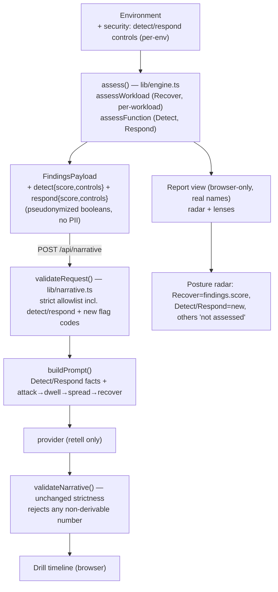

# feat: NIST CSF Detect + Respond posture (MVP)

## Summary

Extend DR Drill from a recovery-only tool into a NIST CSF 2.0 posture assessment by adding **Detect** and **Respond** as deterministically-scored functions beside the existing Recover engine. Controls are assessed **per-environment**, scored from calibrated weights (never LLM-rated), surfaced as a **per-function posture radar**, and woven into the drill as a qualitative attack-to-recovery story. Scope is the MVP slice only — the CSF shell plus Detect/Respond.

---

## Problem Frame

The engine today computes only recovery (RPO/RTO/3-2-1). The origin brainstorm reframes the product around the six NIST CSF 2.0 functions, with the existing engine serving as Recover. This plan builds the first two new functions to the same rigor. The hard constraint the reframing must not break: every number stays computed from constants and defensible, and the LLM only retells (see `lib/engine.ts`, `lib/narrative.ts`). A soft maturity questionnaire would satisfy the feature list while destroying that property.

---

## Requirements

Traceability to origin (`see origin: docs/brainstorms/2026-07-09-nist-csf-posture-expansion-requirements.md`).

- R1 — Present resilience under the six CSF functions; existing RPO/RTO assessment becomes Recover, unchanged.
- R2 — Per-function posture radar; only assessed functions scored, others "not yet assessed".
- R3 — No single blended overall posture score while the radar is partial.
- R4 — Intake Detect section (SIEM, centralized logging, endpoint/EDR, network monitoring, alerting, vuln-scan cadence).
- R5 — Intake Respond section (IR plan, response ownership, isolation/segmentation, playbooks, tabletop cadence, breach-notification).
- R6 — Deterministic maturity score per function from calibrated weights; no model-generated score.
- R7 — Detect/Respond gaps become prioritized investment asks.
- R8 — Gaps produce qualitative incident-amplification in the drill; no monetary figure.
- R9 — Drill spans Detect → Respond → Recover, retelling only computed findings.
- R10 — New control signals enter `FindingsPayload` only as pseudonymized booleans/enums; no PII.
- R11 — Every new number computed by pure functions; `validateNarrative` still rejects non-derivable numbers.
- R17 — Detect/Respond assessed per-environment; Recover stays per-workload.
- R18 — Dual depth: generalist default plus opt-in advanced/compliance depth.

Out of scope for this plan: R12–R16 (parallel easy-wins) and all deferred CSF functions — see Scope Boundaries.

---

## Key Technical Decisions

- **Per-environment security controls.** Detect/Respond live on `Environment` as one org-level control set, not on `Workload` — a SIEM or IR plan isn't owned per workload (R17). Recover's per-workload path is untouched.
- **Deterministic maturity scoring.** Each function scores as weighted control presence (`sum(present weights) / sum(all weights) × 100`) from tables in `lib/calibration.ts`; absent controls above a calibrated weight emit gap flags. No LLM anywhere in scoring (R6, R11).
- **Payload extension stays pseudonymized.** `FindingsPayload` gains `detect` and `respond` objects (a per-function score plus environment-level control booleans) — no names, costs, or free text (R10). `validateRequest` in `lib/narrative.ts` is extended in lockstep; its strict allowlist is the enforcement point.
- **Security gaps are posture-kind, money-free.** New gap flag codes map through `riskBoughtDown` (`lib/exposure.ts`) to a posture-kind bought-down with security-specific effect copy — never a monetary amount (R8). The DR downtime money model is unchanged.
- **Radar is in-house SVG, no dependency.** A small hand-rolled radar component mirrors the existing hand-rolled heatmap (`components/heatmap.tsx`); no charting library. Only assessed functions get a spoke value; there is no blended overall number (R2, R3).
- **Recover's readiness score is kept.** The existing `findings.score` is re-presented as the Recover function's spoke — not renamed or removed (R1, R3).
- **Dual depth via a control partition.** Controls are tagged `core` (generalist default) vs `advanced` in calibration; a depth toggle reveals the advanced set and swaps plain labels for raw CSF terminology (R18). Both label registers live in the locale files.
- **Drill amplification stays qualitative.** `buildPrompt` gains Detect/Respond control facts and an attack→dwell→spread→recover structure, with a rule to describe dwell/spread without inventing durations. Booleans carry no numbers, so `allowedNumbers`/`validateNarrative` keep their current strictness (R9, R11).

---

## High-Level Technical Design

The new signals ride the existing browser-only → trust-boundary → retell pipeline. Detect/Respond are org-level; Recover stays per-workload.

---

## Implementation Units

### U1. Detect/Respond control model, calibration, and deterministic scoring

- **Goal:** Model per-environment Detect/Respond controls and compute a maturity score plus gap flags for each, deterministically.
- **Requirements:** R4, R5, R6, R10, R11, R17.
- **Dependencies:** none.
- **Files:** `lib/engine.ts`, `lib/calibration.ts`, `lib/engine.test.ts`.
- **Approach:** Extend `Environment` with an optional `security` field holding two control maps (Detect, Respond) of booleans — environment-level, no workload attribution. In `lib/calibration.ts` add control definitions (key, function, `core`/`advanced` tag) and per-control weights, plus the gap-emission threshold. Add pure `assessFunction(controls, weights)` returning `{ score, gaps }` where score is weighted presence and gaps are absent controls above the threshold. Extend the `FlagCode` union with Detect/Respond gap codes. `assess()` calls both functions, adds `detect` and `respond` (score + control booleans) to both the `Assessment` view and `FindingsPayload`.
- **Patterns to follow:** `TIER_TARGETS` and `assessWorkload`/`collectFlags` in `lib/engine.ts`; the "every constant in calibration" convention.
- **Test scenarios:**
  - All controls present → score 100, no gaps.
  - No controls / absent `security` block → score 0, all above-threshold gaps emitted.
  - Partial controls → weighted score matches the weight table; only above-threshold absentees flagged.
  - Weight table: score is invariant to control ordering; empty weight set does not divide by zero.
  - `FindingsPayload` carries only booleans + numeric scores for detect/respond (no strings) — asserts the trust-boundary shape.
  - Existing Recover outputs (tier targets, per-workload RPO/RTO, score) unchanged by the additions.

### U2. Extend the trust-boundary validator for the new payload

- **Goal:** `validateRequest` accepts the Detect/Respond payload fields and new gap flag codes while still rejecting unknown keys and any PII.
- **Requirements:** R10, R11.
- **Dependencies:** U1.
- **Files:** `lib/narrative.ts`, `lib/narrative.test.ts`.
- **Approach:** Add `detect` and `respond` to the findings key allowlist; validate each as `{ score: number 0–100, controls: Record<string, boolean> }` with its own key allowlist and no extra keys. Add the new gap codes to `FLAG_CODES`. Everything else stays as-is: unknown keys, strings where booleans expected, and out-of-range scores are rejected.
- **Patterns to follow:** the existing hand-rolled key-allowlist validation in `validateRequest`.
- **Test scenarios:**
  - Valid payload with detect/respond passes.
  - Unknown key inside `detect` → rejected.
  - Non-boolean control value → rejected.
  - `score` out of `[0,100]` → rejected.
  - New gap flag code accepted; a bogus flag code rejected.
  - A smuggled name/free-text field anywhere in the payload → rejected (PII guard).

### U3. Security gaps in the investment model

- **Goal:** Detect/Respond gaps become prioritized investment asks with security-specific, money-free effect text.
- **Requirements:** R7, R8.
- **Dependencies:** U1.
- **Files:** `lib/exposure.ts`, `lib/investment.ts`, `lib/exposure.test.ts`.
- **Approach:** `riskBoughtDown` maps each new gap code to a posture-kind bought-down carrying no amount; effect copy is security-specific (e.g. "closes a detection gap") rather than the generic resilience line, resolved via the lens/locale. `orderAsks` ranks critical security gaps alongside DR asks by existing severity/kind ordering.
- **Patterns to follow:** the `switch (flag.code)` shape in `riskBoughtDown`; `KIND_RANK` ordering in `orderAsks`.
- **Test scenarios:**
  - Each new gap code → posture kind, `amount` null.
  - A critical Detect/Respond gap orders ahead of a warning-level DR gap.
  - Existing DR asks and their amounts are unchanged.

### U4. Intake — per-environment Security step with dual depth

- **Goal:** Collect Detect/Respond controls once per environment, generalist by default with an advanced/compliance depth toggle.
- **Requirements:** R4, R5, R17, R18.
- **Dependencies:** U1.
- **Files:** `components/intake.tsx`, `app/page.tsx`, `lib/locales/en.ts`, `lib/locales/id.ts`.
- **Approach:** Add a Security step (or a labelled subsection after Protection) rendering Detect and Respond controls as grouped toggles, driven by the control catalog from `lib/calibration.ts`. A depth toggle (generalist ↔ advanced) reveals `advanced`-tagged controls and swaps plain labels for raw CSF terms; default is generalist. Wire the `security` control set into `Environment` state in `app/page.tsx`. Both label registers (plain + CSF) live in the locale files.
- **Patterns to follow:** the 3-step wizard and the Protection step in `components/intake.tsx`; the `Environment` state held in `app/page.tsx`.
- **Test scenarios:** Test expectation: none — presentational wiring over the catalog and scoring already covered in U1. (If the core-vs-advanced partition or default-depth selection is extracted into a pure helper, cover: default depth is generalist; `core ⊂ all`; advanced adds only `advanced`-tagged controls.)

### U5. Report — CSF posture radar and framing

- **Goal:** Present a per-function posture radar; Recover from the existing score, Detect/Respond from the new scores, other functions "not yet assessed"; no blended overall number.
- **Requirements:** R1, R2, R3.
- **Dependencies:** U1.
- **Files:** `components/posture-radar.tsx` (new), `components/report.tsx`, `lib/locales/en.ts`, `lib/locales/id.ts`.
- **Approach:** New `posture-radar.tsx` renders a six-spoke SVG radar from a `{ function: score | null }` map (null → "not assessed" spoke, rendered distinctly, contributing no value). Placed at the top of the report above the lens selector. Recover spoke = `findings.score`; Detect/Respond spokes = new scores; Govern/Identify/Protect = null. Function labels come from the locale in both registers.
- **Patterns to follow:** the hand-rolled SVG/coordinate approach in `components/heatmap.tsx`; `components/report.tsx` container.
- **Technical design (directional):** extract a pure `radarPoints(scores, radius)` helper (function index → angle → x/y) so geometry is unit-testable; the component is a thin SVG wrapper over it.
- **Test scenarios:** (pure helper) all-100 → points on the outer ring; 0 → center; partial → proportional radius; a null function → excluded from the value polygon and marked unassessed. Component rendering itself: Test expectation: none.

### U6. Report — Detect/Respond findings in the technical and investment lenses

- **Goal:** Surface Detect/Respond scores and gaps in the technical lens, and their fix-asks in the investment lens.
- **Requirements:** R2, R7.
- **Dependencies:** U1, U3.
- **Files:** `components/lenses/technical-lens.tsx`, `components/lenses/investment-lens.tsx`, `lib/locales/en.ts`, `lib/locales/id.ts`.
- **Approach:** Technical lens gains a security-posture block (Detect/Respond scores + gap list). Investment lens needs no new ask-rendering — new security asks flow through `orderAsks` (U3) automatically; add the security effect copy and flag titles to the locale.
- **Patterns to follow:** existing gap/flag rendering in `components/lenses/technical-lens.tsx`; the asks list in `components/lenses/investment-lens.tsx`.
- **Test scenarios:** Test expectation: none — presentational; ask ordering/effect logic covered by U3, scores by U1.

### U7. Drill narrative — attack-to-recovery across Detect/Respond/Recover

- **Goal:** Extend the drill prompt with Detect/Respond control facts and a full attack→dwell→spread→recover framing, qualitatively, with no invented numbers.
- **Requirements:** R9, R11.
- **Dependencies:** U1, U2.
- **Files:** `lib/narrative.ts`, `lib/narrative.test.ts`.
- **Approach:** `buildPrompt` FACTS gain Detect/Respond controls (present/absent) and a gap summary; add beat-structure guidance (detection → containment → recovery) and an explicit rule to describe dwell/spread qualitatively and invent no durations. `allowedNumbers` and `validateNarrative` are unchanged — the new facts are booleans and carry no numbers.
- **Patterns to follow:** the FACTS/RULES structure in `buildPrompt`; the language and no-invented-number rules already present.
- **Test scenarios:**
  - `buildPrompt` output includes the Detect/Respond control facts and the containment framing.
  - A story that cites an invented dwell-time number → `validateNarrative` still rejects it. **Covers R11.**
  - A story with only allowed numbers plus qualitative amplification → passes.

---

## Scope Boundaries

**Deferred for later** (from origin; future phases)
- Govern, Identify, and Protect CSF functions.
- Multi-site modeling, per-workload backup window, replication what/via detail, per-workload/per-site protection granularity.
- Left-right canvas intake — revisit when input volume makes the wizard tiring.
- Performance/HA investment angle.

**Outside this product's identity** (from origin; positioning rejections)
- A live news feed — breaks the browser-only / no-egress promise.
- LLM-generated maturity ratings or any model-invented number.
- Fear-inflated impact figures.
- Raw performance benchmarking (latency/capacity).

**Deferred to Follow-Up Work** (plan-local sequencing)
- CSF content in the C-level PDF (`lib/pdf.ts`) — the existing DR PDF is unchanged this plan.
- Parallel easy-wins greenlit in the brainstorm but out of this slice: company logo (R12), size-unit dropdown (R13), Annualized Loss Expectancy (R14), report charts beyond the radar (R15), static incident context (R16).

---

## Risks & Dependencies

- **Payload/validator lockstep.** A `FindingsPayload` change that lands without the matching `validateRequest` update makes the route reject every request (400). Mitigation: U2 immediately follows U1 and shares the engine types.
- **Narrative number leak.** Putting a posture score into the story would trip `validateNarrative`. Mitigation: U7 keeps Detect/Respond amplification qualitative; scores are shown in the report, not the drill.
- **Calibration is provisional.** Control weights are placeholders needing a practitioner pass before launch, exactly like the tier targets. Tracked as an assumption, not a blocker.
- **i18n symmetry.** Every new key must land in both `lib/locales/en.ts` (defines the `Dictionary` type) and `lib/locales/id.ts` or the build breaks.

---

## Open Questions (deferred to implementation)

- Exact numeric weight per control — set provisional values in `lib/calibration.ts`, flagged for practitioner calibration.
- Radar label legibility on phone-width viewports — resolve while building U5 (abbreviate spoke labels if they collide).
- Whether the security-posture block is cleanest inside the technical lens or as its own subsection — settle when wiring U6.

---

## Sources & Research

- Origin requirements: `docs/brainstorms/2026-07-09-nist-csf-posture-expansion-requirements.md`.
- Key code touched: `lib/engine.ts` (`assess`, `FindingsPayload`, `collectFlags`), `lib/calibration.ts` (constants convention), `lib/narrative.ts` (`validateRequest`, `buildPrompt`, `validateNarrative`, `allowedNumbers`), `lib/exposure.ts` (`riskBoughtDown`), `lib/investment.ts` (`orderAsks`), `components/intake.tsx`, `components/report.tsx`, `components/heatmap.tsx` (radar pattern), `components/drill.tsx`, `lib/locales/en.ts` + `id.ts`.
- External research: none. Local patterns are strong across the full pipeline and the Detect/Respond control taxonomy is settled in the origin doc.
